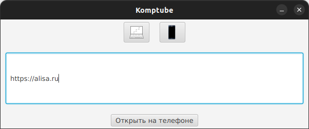
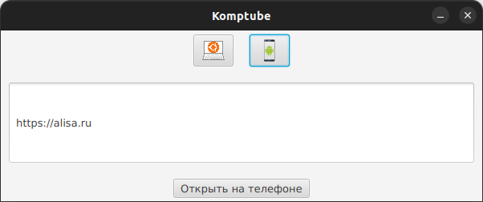

### Обмен ссылками между телефоном и компом в локальной сети:
- локальный сервер на основе NanoHTTPD
- UI для отправки ссылки на телефон и health check локального сервера и на телефоне
- расширение Chrome для быстрой отправки на телефон

Приложение для телефона - https://github.com/VadimLofitsky/komptube_android

Адреса локального сервера и сервера на телефоне при запуске в IDE или **jar** локального сервера или UI
указываются в переменных окружения в качестве аргументов VM:

`-Durls.phone="http://192.168.1.3:8765" -Durls.local_backend="http://localhost:8765"`

В проекте в настройках проекта можно создать артефакты для komptube-back и komptube-ui и ребилдить их при необходимости.
Затем с помощью скрипта `cpjar2scripts.sh` скопировать артефакт в рабочую директорию.

#### Health check в UI

